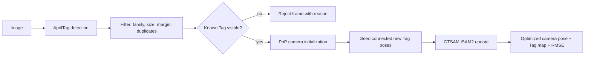

# TagAtlas

[](https://github.com/WallyHao/tag-atlas/actions/workflows/ci.yml)
[](LICENSE)
[](pyproject.toml)
[](https://github.com/astral-sh/ruff)
[](https://mypy-lang.org/)
[](docs/verification.md)
[](https://github.com/astral-sh/uv)

**Multi-AprilTag 6-DoF localization and pose fusion for robotics.**

TagAtlas estimates a calibrated camera's pose from one or more AprilTags. It
builds an incremental GTSAM factor graph, discovers unknown Tag poses online,
and fuses every visible Tag with a robust noise model. It is a self-contained
Python library: no ROS, no GPU, no simulator required.

## Features

- **6-DoF camera localization** from a single Tag, improving as more Tags enter
  the frame.
- **Online map discovery** or **fixed-map localization** against a saved map.
- **Incremental pose graph** using GTSAM `ISAM2` with analytic `Pose3`
  Jacobians for an eight-dimensional corner-projection factor.
- **Robust estimation** with Huber or Cauchy losses for outlier rejection.
- **Immutable, validated, typed** public models; strict-mypy clean and
  PEP 561 typed.
- **Deterministic failure handling**: unobservable frames are rejected with a
  reason instead of corrupting the graph, and a failed graph update rolls back.

## Architecture



The fixed reference Tag defines the world frame. A transform is named
`T_dst_src` when it converts coordinates from `src` to `dst`, so the returned
pose is `T_world_camera` and a detector measurement is `T_camera_tag`. See
[`docs/architecture.md`](docs/architecture.md) for the full convention and
module boundaries.

## Install

TagAtlas is not yet published on PyPI. Install from source:

```bash
git clone https://github.com/WallyHao/tag-atlas.git
cd tagatlas
uv sync
```

A Python 3.11 or 3.12 environment is required because of the GTSAM wheels.

## Quickstart

```python
import cv2
import numpy as np

from tagatlas import CameraModel, Localizer, LocalizerConfig, TagMap

camera = CameraModel(
    matrix=np.array(
        [[603.9, 0.0, 665.0], [0.0, 603.2, 554.3], [0.0, 0.0, 1.0]],
        dtype=np.float64,
    ),
    distortion_coefficients=np.array([-0.01, 0.001, 0.0, 0.0, 0.0], dtype=np.float64),
)

tag_map = TagMap(reference_tag_id=0, tag_sizes={0: 0.12, 1: 0.12, 2: 0.15})

localizer = Localizer(
    camera=camera,
    tag_map=tag_map,
    config=LocalizerConfig(robust_loss="huber"),
)

image = cv2.imread("frame.png")
if image is None:
    raise RuntimeError("unable to read frame.png")

result = localizer.locate(image)
if result.success:
    print(result.camera_pose)
    print(result.tag_poses)
else:
    print(f"frame rejected: {result.reason}")
```

Call `locate()` on sequential frames and `reset()` to clear the trajectory and
discovered map. The default detector is `pupil-apriltags`; a custom detector can
be injected through the `detector` argument. Localization always returns a
`LocalizationResult`, so a frame with no usable Tag is reported through `reason`
and `diagnostics` rather than raised as an exception.

Use `TagMap.to_json()` / `TagMap.from_json()` to persist a discovered map, and
set `LocalizerConfig(map_mode="fixed")` to localize against saved Tag poses.

## Package Layout

```text
src/tagatlas/
  models.py              Public data models and algorithm configuration
  tag_map.py             Static Tag map configuration
  camera.py              Camera calibration and projection
  geometry.py            SE(3), tag geometry, and PnP
  apriltag_detector.py   AprilTag detector adapter and filtering
  initialization.py      PnP pose seeding
  metrics.py             Reprojection quality metrics
  pose_graph.py          GTSAM incremental graph
  logging_utils.py       Application logging configuration
  localizer.py           Stateful localization pipeline
tests/                   Automated tests
```

## Documentation

- [`docs/usage.md`](docs/usage.md) — the complete workflow.
- [`docs/architecture.md`](docs/architecture.md) — coordinate convention and
  module boundaries.
- [`docs/verification.md`](docs/verification.md) — quality gates and test data.
- [`docs/performance.md`](docs/performance.md) — what a benchmark must report.
- [`examples/README.md`](examples/README.md) — a live online-mapping example
  with 2D and 3D visualization.

## Development

```bash
uv sync --dev
uv run pytest            # enforces >=90% branch coverage
uv run ruff check .
uv run ruff format --check .
uv run mypy src
```

The same checks run in CI on Python 3.11 and 3.12. See
[`CONTRIBUTING.md`](CONTRIBUTING.md) before opening a pull request.

## License

Released under the [MIT License](LICENSE).
